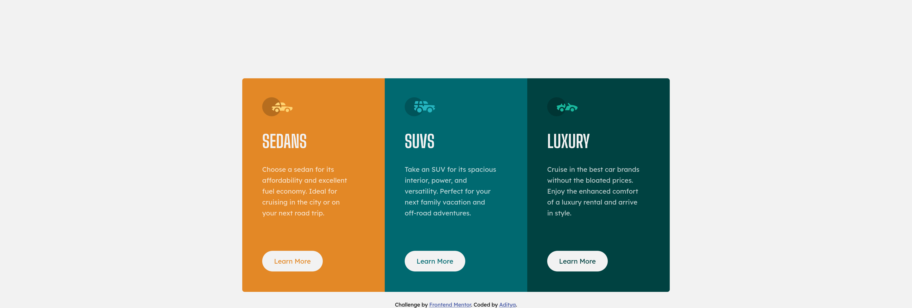

# Frontend Mentor - 3-column preview card component solution

This is a solution to the [3-column preview card component challenge on Frontend Mentor](https://www.frontendmentor.io/challenges/3column-preview-card-component-pH92eAR2-). Frontend Mentor challenges help you improve your coding skills by building realistic projects.

## Table of contents

- [Overview](#overview)
  - [The challenge](#the-challenge)
  - [Screenshot](#screenshot)
  - [Links](#links)
- [My process](#my-process)
  - [Built with](#built-with)
  - [What I learned](#what-i-learned)
  - [Continued development](#continued-development)
  - [Useful resources](#useful-resources)
- [Author](#author)
- [Acknowledgments](#acknowledgments)

## Overview

### The challenge

Users should be able to:

- View the optimal layout depending on their device's screen size
- See hover states for interactive elements

### Screenshot

**My Solution**




**Original Design**


### Links

- Code Solution URL: [GitHub](https://github.com/adityavinodh/3-column-preview-card-component)
- Live Site URL: [Hosted on Vercel](https://3-column-preview-card-component-plum.vercel.app/)

## My process

### Built with

- CSS custom properties
- CSS Columns
- CSS Media Queries
- Mobile-first workflow

### What I learned

I learnt to use CSS custom properties, or variables in simple terms. This allowed me to set the three main colors of this design before hand, and reuse/apply these colors where ever they were required. In the global scope (along with other styles):

```css
html,
body {
  --orange: hsl(31, 77%, 52%);
}
```

Then, I can set these to other properties. For example:

```css
p {
  color: var(--orange);
}
```

I also integrated CSS Media Queries to set breakpoints at which I would change the column structure to update the UI for mobile view.

### Continued development

I will continue to keep this project and repository active. If you have any issues, suggestions, or feedbacks, please let me know. Feel free to add an issue, or submit a pull request.

I am going to explore further into CSS and web development.

### Useful resources

- [CSS-Tricks](https://css-tricks.com) - This website has many helpful blog posts, examples and tutorials. I used this for learning the CSS Columns implementation, and was very happy with the explanation.
- [W3 Schools](https://www.w3schools.com) - This is an amazing resource for references when I get stuck or forget something at any point of time during development.

## Author

- Website - [Aditya](https://yo.adityaone.com)
- Frontend Mentor - [@adityavinodh](https://www.frontendmentor.io/profile/adityavinodh)
- Twitter - [@THEadityavinodh](https://www.twitter.com/THEadityavinodh)

## Acknowledgments

I would like to thank Frontend Mentor for providing this experience and platform, as well as the author for creating this challenge.
